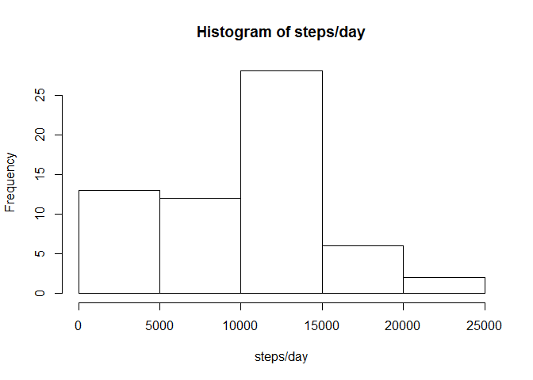
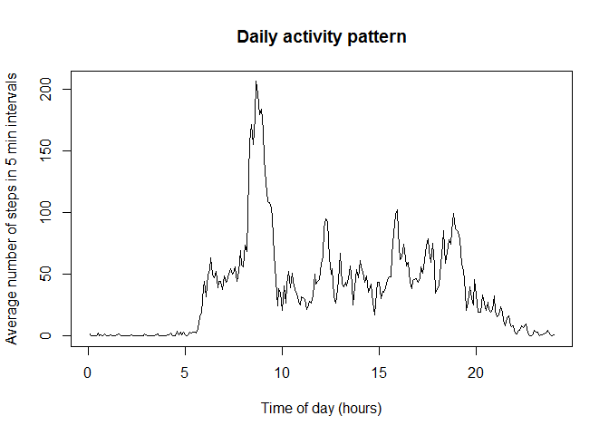
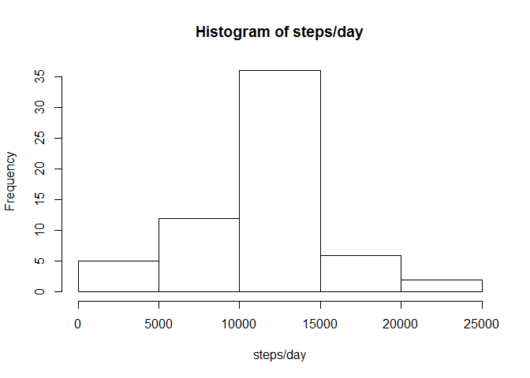
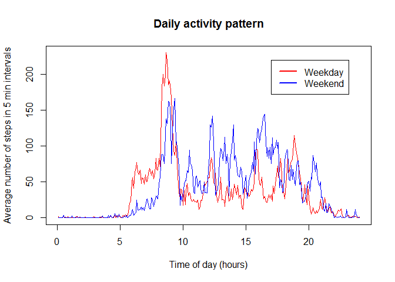

# Reproducible Research: Peer Assessment 1
MS  
Raw data is from a personal activity monitoring device. This device collects data at 5 minute intervals through out the day. The data consists of two months of data from an anonymous individual collected during the months of October and November, 2012 and include the number of steps taken in 5 minute intervals each day. Data is downloaded from the coursera course "Reproducible research" on January 8th 2016.


## Loading and preprocessing the data
The data is loaded in and the interval column is converted to minutes after midnight instead of the non-standard format the data is supplied with.

```r
    #load the data
    dat <- read.csv("activity.csv")
    #Convert the interval column to minuts after midnight
    dat$interval<-with(dat,as.double(rep(as.double(seq(unique(interval)))*5,length(interval)/length(unique(interval)))))
```


## What is mean total number of steps taken per day?
The total number of steps on individual days is calculated. The data is represented in a histogram plot and the mean and median steps pr day is printed out.


```r
#Separate the data according to the date and calculate the sum
    stepsDay<-tapply(dat$steps, dat$date, function(x) sum(x, na.rm=TRUE))
    #Plot a histogram of the steps pr day
    hist(stepsDay,
         main="Histogram of steps/day",
         xlab="steps/day")
```

\

```r
    #Print out the median and mean steps pr day
    print("Mean number of steps taken pr day")
```

```
## [1] "Mean number of steps taken pr day"
```

```r
    print(as.integer(round(mean(stepsDay),0)))
```

```
## [1] 9354
```

```r
    print("Median number of steps taken pr day")
```

```
## [1] "Median number of steps taken pr day"
```

```r
    print(as.integer(median(stepsDay)))
```

```
## [1] 10395
```
Most days have between 10k and 15k steps but the data is skewed toward low amount of steps pr day. This is likely due to the absence of data.

## What is the average daily activity pattern?
The average activity during the day in 5 min intervals is calculated as the average number of steps from the data over all days in that interval. The activity is plotted and the time of highest activity is printed out.

```r
    #Separates the data according to the time of day and calculates the average.
    steps5MinInterval<-tapply(dat$steps, dat$interval, function(x) mean(x, na.rm=TRUE))
    #Plot the data as time of day vs. the number of steps
    plot(as.double(rownames(steps5MinInterval))/60,steps5MinInterval, 
         type="l",
         xlab = "Time of day (hours)",
         ylab = "Average number of steps in 5 min intervals",
         main = "Daily activity pattern")
```

\

```r
    #Find and print out the time of day with highest activity
    print("Time of highest activity")
```

```
## [1] "Time of highest activity"
```

```r
    stepMax5MinInterval <- as.double(rownames(steps5MinInterval))[which.max(steps5MinInterval)]
    print(paste0(floor(stepMax5MinInterval/60),":",stepMax5MinInterval %% 60))
```

```
## [1] "8:40"
```
The activity is low in from ~9 pm to 6 am, corresponding to a normal sleeping pattern. This person likely wakes up around 6-7 am and heads off to work/school around 8:30 corresponding to a sharp increase in activity. The activity is relatively even during the day with peaks around lunch, 4 pm and 7 pm.


## Imputing missing values
To remove the bias toward low steps/day due to N/A values, the N/A values are substituted with the average in that interval calculated from all other days.

```r
    #which values are missing? Print out the amount (as both specific and relative)
    missingValues <- is.na(dat$steps)
    print("The amount of missing data points")
```

```
## [1] "The amount of missing data points"
```

```r
    print(paste0(sum(missingValues)," (",round(sum(missingValues)/length(dat$steps)*100,0),"%)"))
```

```
## [1] "2304 (13%)"
```

```r
    #Calculates the mean steps on all days at the specific times.
    meanSteps<-tapply(dat$steps, dat$interval, function(x) mean(x, na.rm=TRUE))
    #Substitutes the missing values with the mean in new variable newDat
    newDat<-dat
    newDat$steps[missingValues]<-rep(meanSteps,length(dat$steps)/length(meanSteps))[missingValues]
    
    #Separate the data according to the date and calculate the sum
    stepsDay<-tapply(newDat$steps, newDat$date, function(x) sum(x, na.rm=TRUE))
    #Plot a histogram of the steps pr day
    hist(stepsDay,
         main="Histogram of steps/day",
         xlab="steps/day")
```

\

```r
    #Print out the median and mean steps pr day
    print("Mean number of steps taken pr day")
```

```
## [1] "Mean number of steps taken pr day"
```

```r
    print(as.integer(round(mean(stepsDay),0)))
```

```
## [1] 10766
```

```r
    print("Median number of steps taken pr day")
```

```
## [1] "Median number of steps taken pr day"
```

```r
    print(as.integer(median(stepsDay)))
```

```
## [1] 10766
```
The histogram skewness is reduced and is now close to the expected gaussian distribution.

## Are there differences in activity patterns between weekdays and weekends?
To determine if there are differences in activity in the weekdays and weekends the data is subsetted and analysed as before.

```r
    #The new weekday/weekend factor is calculated from the data variable.
    isWeekend<-factor(floor(as.integer(strftime(as.Date(newDat$date),"%u"))/6), labels = c("Weekday","Weekend"))
    #Add the factor to the data frame
    newDat<-cbind(newDat,isWeekend)
    #Calculate the daily activity as in calc_Dailypattern but with the data separated by the new factor
    steps5MinInterval<-data.frame(tapply(newDat$steps, newDat[,3:4], function(x) mean(x, na.rm=TRUE)))
    #Plot the new data with weekday in red and weekend in blue.
    plot(as.double(rownames(steps5MinInterval))/60,steps5MinInterval$Weekday, col="red",
         type="l",
         xlab = "Time of day (hours)",
         ylab = "Average number of steps in 5 min intervals",
         main = "Daily activity pattern")
    lines(as.double(rownames(steps5MinInterval))/60,steps5MinInterval$Weekend, col="blue")
    legend(17,220, c("Weekday","Weekend"), lty=c(1,1), col=c("red","blue"), lwd=c(2.5,2.5),)
```

\
The weekend has lower activity during the early morning hours (6-9am) and greater general activity during the day (10 am-21pm)

